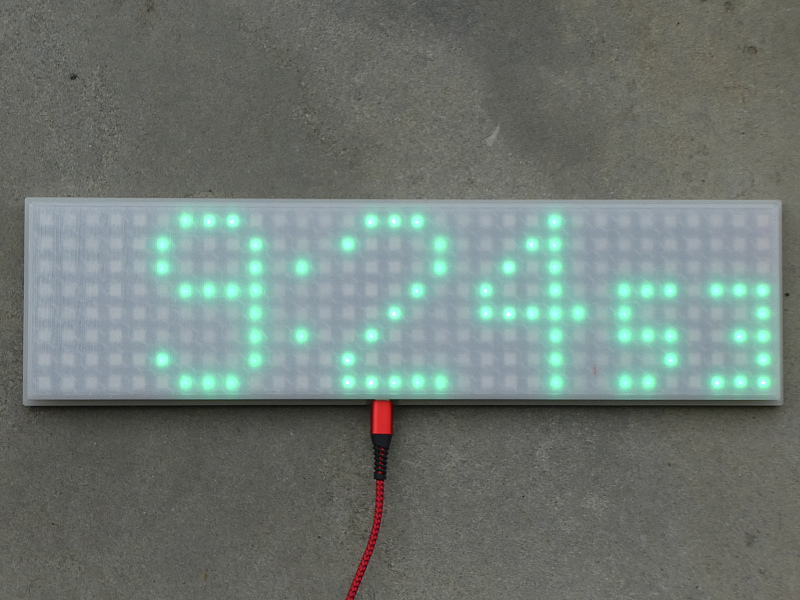

# Neo clock 3: NeoPixel (WS2812B) 8x32 matrix with Raspberry Pi Pico W using NTP

## All infos on: <http://www.weigu.lu/microcontroller/neo_clock_3/index.html>

## Some infos

A simple digit clock using NTP written in Micropython. 

I used a Raspberry Pi Pico W and added only an LDR to adjust automatically the brightness of the display.

The 3D printed housing was created with FreeCAD. I used transparent PLA filament. You need a 300mm² square bed print the front (45° rotation).

